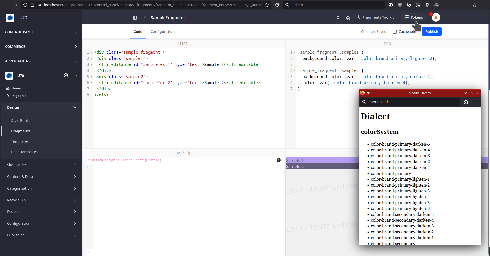

# stylebook-tokendisplay-web

## What is this?

This plugin generates a button in the fragment editor that gives you access
to all themes' usable CSS tokens, so that you have a reference of the values
that you can use in your fragment's CSS. E.g. in the Dialect Theme, you may 
use `var(--color-brand-primary-lighten-2)` to address a color from the configured
stylebook

## How to use

Place this plugin in a Liferay Workspace's `modules` directory, build and deploy it. 

It automatically creates a button in the ProductMenu of the Fragments Editor

## To Do

The UI is _extremely simple_. Feel free to contribute something more fancy.

## Screenshot

