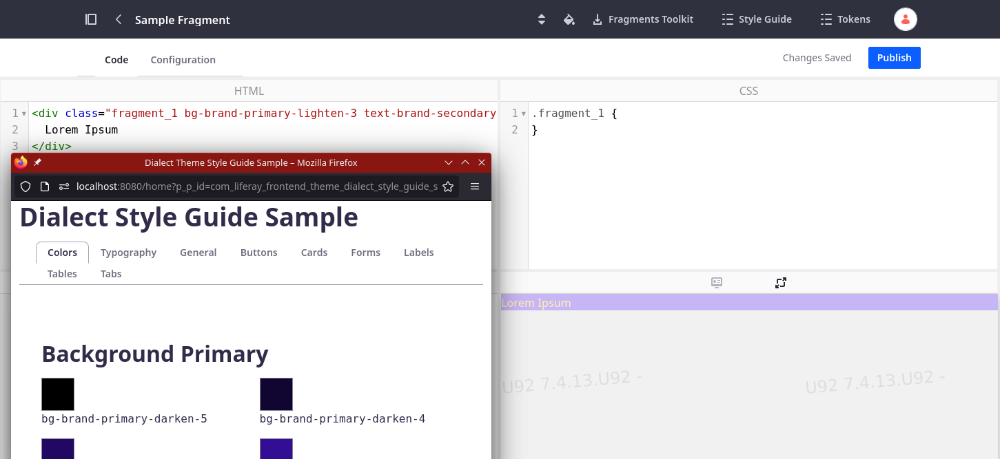

# stylebook-tokendisplay-web

## What is this?

This plugin generates a button in the fragment editor that gives you access
to either the Classic or Dialect themes' usable CSS tokens via their own sample portlets, so that you have a reference of the values
that you can use in your fragment's CSS. E.g. in the Classic Theme, you may 
use `var(--primary)` to address a color from the configured stylebook.

This plugin also makes the stock Styleguide portlets for Classic and Dialect themes available in your editor - depending on which theme is configured for your top level pages.

The Dialect theme provides helper classes that you can use directly, e.g. as `
` - these can be easily discovered in the styleguide.

## How to build/use

Place this plugin in a Liferay Workspace's `modules` directory, build and deploy it.

This plugin has been developed with `liferay.workspace.product=dxp-7.4-u70` and last tested with Update 92. 

It automatically creates a button in the ProductMenu of the Fragments Editor if either of the known themes is active in the current site's LayoutSet

You'll also need to drop the config files in this project's `supporting-config` folder into your instance's `osgi/configs` folder, so that the sample portlets are properly configured.

## To Do

Requires manual updates when other themes come with their own sample widget 

## Screenshots

### Dialect Theme

### Classic Theme

